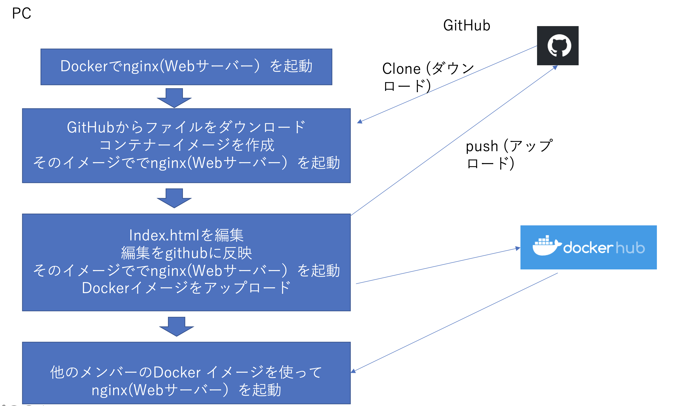
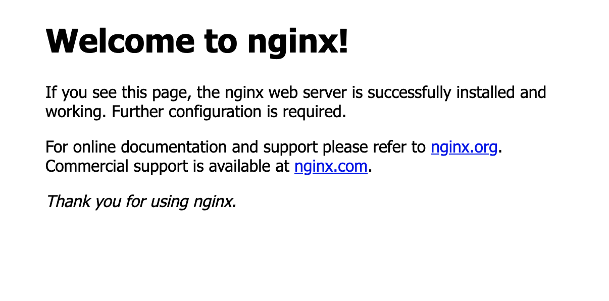

# docker-sample-nginx

<kbd></kbd>

A sample nginx container for training

## 事前準備

以下のソフト、アカウントの準備を事前にしてください。

-Dockerのインストール、

https://www.docker.com/products/docker-desktop

(Windows 10の場合、BIOSでIntel VT, 仮想化の有効化、Linuxカーネルのダウンロードが必要な場合があります）

-Docker Hubのアカウント作成(Sign Up)

https://hub.docker.com/

-Gitのインストール

マック
1. Homebrewのインストール　　https://brew.sh/index_ja (マックの場合）

2. HomeBrewを使ってgitをインストール  https://git-scm.com/download/mac

Windows

https://gitforwindows.org/

-Githubのアカウント作成(Sign Up)

https://github.com/


## 実施手順

## 1.
マックだったらターミナル、WindowsであればPower Shellを起動
以下のコマンドでウェブサーバーを起動する(Dockerの動作確認)

```
$ docker run --rm -d -p 8080:80 --name web nginx
```

ブラウザーで　http://localhost:8080 にアクセスして動作確認

このように表示されるはずです。

<kbd></kbd>

動作を停止

```
$ docker stop web
```
## 2.
Githubびログイン後以下のアドレスにアクセス、レポジトリーをFork


```
https://github.com/osonoi/docker-sample-nginx.git
```

参考：　https://github.com/IBMDeveloperTokyo/DojoBasicLab/tree/master/Lab3_GitHub/Lab3-1_GitHub

このレポジトリーをClone

```
$ git clone https://github.com/(ご自分のアカウント名)/docker-sample-nginx.git

$ cd docker-sample-nginx
```

Dockerfile, indexを参照
イメージを作成

```
$ docker build -t webserver .
```

イメージを起動

```
$ docker run --rm -d -p 8080:80 --name web webserver
```

ブラウザーで　http://localhost:8080 にアクセスして動作確認

このように表示されるはずです。

<kbd></kbd>

動作を停止

```
$ docker stop web
```
## 3.
index.htmlを編集


イメージを作成

```
$ docker build -t webserver .
```

イメージを起動

```
$ docker run --rm -d -p 8080:80 --name web webserver
```

ブラウザーで　http://localhost:8080 にアクセスして動作確認

変更をgithubに反映

```
$ git init
$ git add index.html
$ git commit -m "コメント変更"
$ git push origin main
```


動作を停止

```
$ docker stop web
```

イメージをDockerHubにアップロード

```
$ docker login
$ docker tag webserver (ご自分のアカウント名)/webserver
$ docker push (ご自分のアカウント名)/webserver:latest

```

dockerHubでイメージを確認

https://hub.docker.com/

DockerHubのイメージで起動(できれば他のメンバーのアカウントのイメージを使って）

```
docker run --rm -d -p 8080:80 --name web (誰かののアカウント名)/webserver
```

